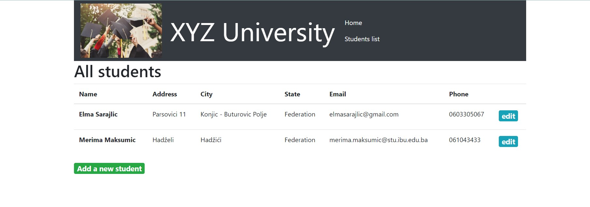
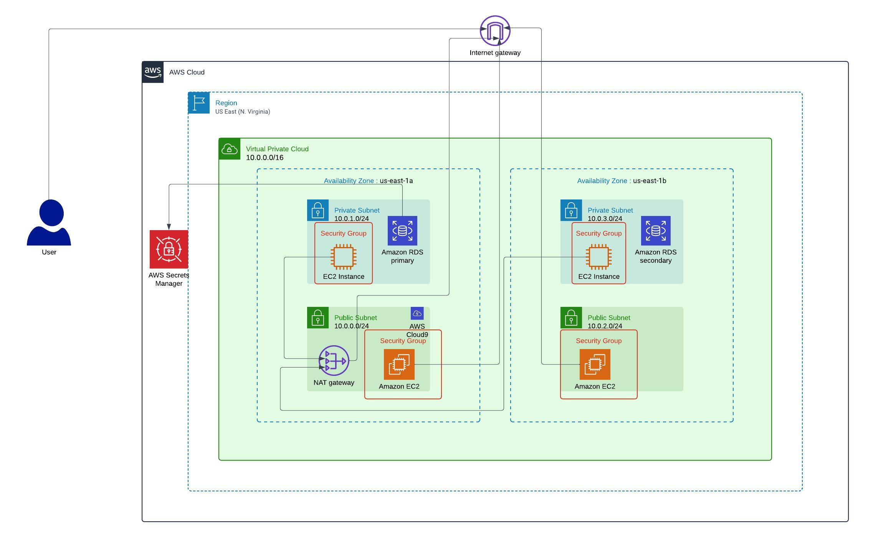
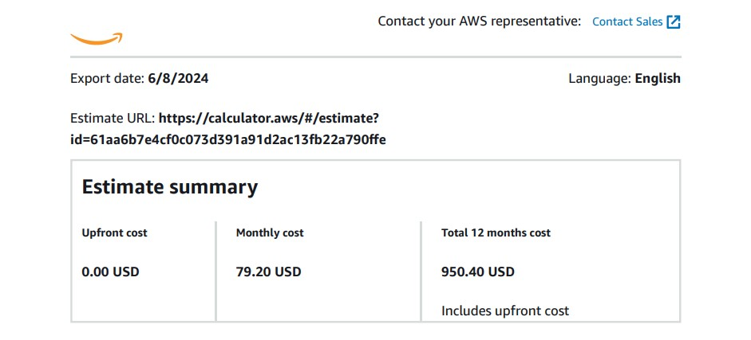

# DevOps Project

## Intro to the project
Example University is preparing for the new school year. The admissions department has received complaints that their web application for student records is slow or not available during the peak admissions period because of the high number of inquiries. Our challenge is to plan, design, build, and deploy the web application to the AWS Cloud in a way that is consistent with best practices of the AWS Well-Architected Framework. This project demonstrates a proof of concept (POC) to host a student records web application in the AWS Cloud. The objective is to improve the experience for users by ensuring the application is highly available, scalable, load balanced, secure, and high performing.

### Homepage

### List of students

## Phase 1: Planning the design and estimating cost
In the first phase of the project, we developed our initial plan and created an infrastructure diagram. We also estimated the cost of the proposed solution using the AWS Pricing Calculator.

### Diagram one: Phase 2

### Diagram two: Phase 3

### Diagram three: Phase 4 - final diagram

### Estimated costs

*(Complete Estimated Cost file can be found in Docs folder)*

## Phase 2: Creating a basic functional web application

### Task 1: Creating a Virtual Network

1. **Create a VPC:**  
   Creating a Virtual Private Cloud (VPC) provides an isolated network environment to host our resources securely. We created a VPC (project-vpc) with the IPv4 CIDR block 10.0.0.0/16. This provides a large address space for our VPC, allowing for many subnets and resources.

2. **Enable DNS Hostnames for VPC:**  
   Enabling DNS hostnames ensures that instances launched within the VPC can resolve and be resolved by DNS.

3. **Create Subnets:**  
   We created four subnets, two public subnets and two private subnets in two different regions (us-east-1a and us-east-1b). Subnets divide the VPC into smaller, manageable segments, allowing for better organization and security.
   - Subnet Private 1:  
     - VPC: project-VPC  
     - Subnet name: Private 1  
     - Availability Zone: us-east-1a  
     - IPv4 CIDR block: 10.0.1.0/24  

   - Subnet Public 1:  
     - VPC: project-VPC  
     - Subnet name: Public 1  
     - Availability Zone: us-east-1a  
     - IPv4 CIDR block: 10.0.0.0/24  

   - Subnet Private 2:  
     - VPC: project-VPC  
     - Subnet name: Private 2  
     - Availability Zone: us-east-1b  
     - IPv4 CIDR block: 10.0.3.0/24  

   - Subnet Public 2:  
     - VPC: project-VPC  
     - Subnet name: Public 2  
     - Availability Zone: us-east-1b  
     - IPv4 CIDR block: 10.0.2.0/24  

4. **Enable Auto-Assign Public IPv4 on Public Subnet 1:**  
   Auto-assigning public IP addresses allows instances in public subnets to be accessible from the internet.

5. **Create an Internet Gateway:**  
   An Internet Gateway allows communication between instances in our VPC and the internet. We created an internet gateway and attached it to our project-vpc.

6. **Create and Configure Route Tables:**  
   Route tables control the traffic flow within the VPC. Public subnets need routes to the Internet Gateway to handle internet traffic. We created route tables for public subnets first, attached them to our project-vpc and attached both our public subnets. Then we added a new route to the Internet Gateway (0.0.0.0/0) which we created previously. This route directs all traffic destined for the internet to the internet gateway.

7. **Create a NAT Gateway:**  
   A NAT Gateway allows instances in private subnets to access the internet for updates and other outbound connections while remaining inaccessible from the internet, enhancing security. We created a new NAT gateway and attached it to our public subnet 1 (Region: us-east-1a) and enabled Elastic IP allocation ID. An Elastic IP ensures a consistent IP address for the NAT Gateway.

8. **Create and Configure a Route Table for Private Subnets:**  
   Private subnets need routes to the NAT Gateway for outbound internet traffic, keeping instances secure by not exposing them directly to the internet. We created a new route table for our private subnets, attached it to our project-vpc and attached both our private subnets. Then for this route table, we added a new route to our previously created NAT Gateway (0.0.0.0/0). This route allows instances in the private subnets to access the internet through the NAT Gateway.

9. **Create a Security Group:**  
   Security groups act as virtual firewalls, controlling inbound and outbound traffic to and from instances, ensuring only authorized traffic can access the resources. We created a new security group (project-sg), attached it to our project-vpc and created two inbound rules within it:
   - Inbound rule 1:  
     - Type: HTTP  
     - Protocol: TCP  
     - Port range: 80  
     - Source: Anywhere-IPv4 (0.0.0.0/0)  

   - Inbound rule 2:  
     - Type: MySQL/AURORA  
     - Protocol: TCP  
     - Port range: 3306  
     - Source: Custom (10.0.0.0/16)  

### Task 2: Creating a virtual machine
In this task, we are creating an EC2 instance. EC2 instances are virtual servers that host the web application. Proper configuration ensures they can serve web traffic and interact with other AWS services securely.

1. **Launch an EC2 Instance:**  
   For our EC2 instance, we chose the following details:
   - Name: Instance-1
   - AMI: Ubuntu
   - Key pair: Vockey

   In the network settings:
   - VPC: project-VPC
   - Subnet: Subnet Public 1 (The public subnet to ensure the instance can communicate with the internet directly.)
   - Auto-assign public IP: Enable (Enabling this ensures the instance gets a public IP address, allowing it to be accessed from the internet.)
   - Security group: Select project-sg (Security groups act as a virtual firewall for our instance to control inbound and outbound traffic.)

   For advanced details: Choose Metadata version to be V1 and V2 (token optional) and added a user script in the User data field.

### Task 3: Testing the deployment
In this task, we are accessing the instance we previously created via its Public IPv4 DNS which allows us to interact with the web application hosted on the instance. The Public IPv4 DNS is the address we will use to access our instance over the internet.

## Phase 3: Decoupling the Application Components
In this phase, we aim to separate the database and web server infrastructure so that they run independently. The web application will run on a separate virtual machine, while the database will run on the managed service infrastructure.

### Task 1: Changing the VPC Configuration
Update the virtual network components to support hosting the database separately from the application. Note: We needed private subnets in a minimum of two Availability Zones. We created those subnets and enabled DNS Hostnames for VPC in the previous phase. Private subnets ensure that instances running within them are not directly accessible from the internet, enhancing security. Enabling DNS hostnames allows instances within the VPC to resolve and be resolved by DNS, which is crucial for communication between components.

### Task 2: Creating and Configuring the Amazon RDS Database
In this task, we created an Amazon Relational Database Service (Amazon RDS) database that runs a MySQL engine.

1. **Create a Database Subnet Group:**  
   First, we have to create a subnet group. Attach it to our project-vpc and choose both availability zones (us-east-12, us-east-1b) and both private subnets from each availability zone. A DB subnet group is a collection of subnets that Amazon RDS uses to allocate resources within a VPC. Ensuring that subnets are private enhances security.

2. **Create an RDS Database:**  
   - Selected Standard create.
   - Choose MySQL.
   - Under Production, selected Multi-AZ DB instance. (Multi-AZ deployment provides high availability and failover support for the database.)
   - Set the DB instance identifier: STUDENTS
   - Set the MASTER username and password.
   - Under Credentials management, choose Self managed.
   - Under DB instance class, selected Burstable classes (includes t classes) and choose db.t3.micro. (Choosing a burstable instance class allows cost-effective operation with the ability to handle variable workloads.)
   - Under Storage type, select General Purpose SSD (gp2).
   - Set Allocated storage to 20 GiB.
   - Under Connectivity, choose project-VPC, subnet group and selected the project-sg security group.
   - Disabled Enhanced monitoring.
   - Disabled Deletion protection.
   - In Additional configuration, add initial database name, disabled encryption, disabled auto minor version upgrade and disabled deletion protection.

### Task 3: **Configuring the Development Environment1**
Provisioned an AWS Cloud9 environment to run AWS Command Line Interface (AWS CLI) commands that will be used in later tasks.
1.	Open AWS Cloud9 and Create an Environment:
For environment on Cloud9 (project-c9) we choose from additional instance types t3.micro, for Network settings selected Secure Shell (SSH), attached project-vpc and subnet public 1. 
By placing our Cloud9 environment in a public subnet, we have direct access to the internet. Instances in a public subnet can be accessed directly using their public IP addresses. This can be useful for quickly accessing environment from various locations.
2.	Edit the Cloud9 Script:
    -	Once the RDS instance is created, edit the Cloud9 script to include the database endpoint.
    -	Including the RDS endpoint in the script allows the environment to connect to the database for further tasks and operations.

### Task 4: **Provisioning Secrets Manager**
Secrets Manager is used to store secrets for the database. We can add it manually, or we can use the C9 console and the following command:
  aws secretsmanager create-secret \
    --name Mydbsecret \
    --description "Database secret for web app" \
    --secret-string "{\"user\":\"<username>\",\"password\":\"<password>\",\"host\":\"<RDS Endpoint>\",\"db\":\"<dbname>\"}"

This command creates a secret in AWS Secrets Manager to securely store the database credentials (We replace the placeholders with our actual values).

We can check if our command is successful, by opening the Secrets Manager in AWS CLI and seeing that Mydbsecret is showing on the secrets section. Verifying the secret ensures it has been successfully created and can be used for secure database access.

### Task 5: **Provisioning a New Instance for the Web Server**
In this task we created a new virtual machine to host the web application.
1.	Launch an EC2 Instance for Public Subnet 2:
  -	Name: instance-2
  -	AMI: Ubuntu
  -	Instance type: t2.micro (A t2.micro instance is cost-effective for a small web application.)
  -	Key pair: vockey
  -	Network settings:
      -	VPC: project-VPC
      -	Subnet: Subnet Public 2 (We were following best practices for designing highly available, fault-tolerant and resilient applications, by launching the new EC2 instance in Subnet Public 2. This strategic deployment ensures that our web application can handle failures and continue to serve users without significant interruptions.
      -	Auto-assign public IP: Enable
      -	Security group: Select project-sg
  -	Advanced details:
      -	Select IAM instance profile: LabInstanceProfile
      -	Enable V1 and V2 (token optional)
      -	Add our user script in the User data field

2.	Configure RDS in Cloud9:
•	Selected the newly created database instance.
•	Copy the Public IPv4 DNS of the RDS instance.
•	Edited our Cloud9 script to include the RDS instance endpoint.
Configuring the RDS endpoint in Cloud9 allows the development environment to connect to the database, facilitating further development and testing tasks.
Task 6: Migrating the database
Migrate the data from the original database, which is on an EC2 instance, to the new Amazon RDS database.
1.	Run the Migration Script in Cloud9:
	Ran the following command in the terminal:
•	mysql -h project-db.cu1daqwobdjb.us-east-1.rds.amazonaws.com -u masterusername -p < data.sql (This command connects to the RDS instance and imports the data from the data.sql file).
	Entered the password when prompted.
	Verifed that the application is working correctly.
Task 7: Testing the application
1.	Edit Cloud9 Script with Instance 2 Endpoint:
	Opened the previously downloaded Cloud9 script (script 3).
	Add the private IPv4 address of the first instance to the script.
	Navigate to RDS Dashboard.
	Select Databases → project-db.
	Under Connectivity & security, copy the Endpoint and Port.
	Edit script to include the RDS endpoint and port. (Updating the script with the new instance endpoint ensures that all components can communicate with the database, enabling a fully functional application environment.)

Phase 4: Implementing High Availability and Scalability
In this phase, we will complete the design and fulfill the remaining solution requirements. The objective is to use the key components that we created in earlier phases to build a scalable and highly available architecture.

Task 1: Creating an Application Load Balancer
We launched a load balancer to access our web application. An Application Load Balancer (ALB) helps distribute incoming application traffic across multiple targets, such as EC2 instances, ensuring high availability and reliability.
1.	Create an Image from Instance 2
In the instance 2 we choose action image and templates and created a new image. We only provided name and description for it. 
Creating an image from an existing instance ensures that the Auto Scaling group launches new instances with the same configuration.
2.	Create Target Groups
	Target group name: project-TargetGroup
	Target type: Instances (The target type specifies that the targets registered to this group will be EC2 instances.)
	VPC: project-VPC (We select the VPC where the instances are hosted to ensure proper routing.)
	Health check protocol: HTTP

3.	Create an Application Load Balancer
	Selected Application Load Balancer. (An ALB is designed to handle HTTP and HTTPS traffic, making it ideal for web applications.)
	Name: project-LoadBalancer
	Scheme: Internet-facing (An internet-facing load balancer allows our application to be accessible from the internet.
	IP address type: IPv4
	VPC: project-VPC
	Availability Zones: Selected both public subnets (Subnet Public 1 and Subnet Public 2, using multiple availability zones ensures high availability and fault tolerance.)
	Security group: project-sg
	Under listeners and routing select our target group: project-TargetGrooup
	Selected the previously created target group. This ensures that the load balancer routes traffic to the target group containing our instances.
	Registered both instances (Instance 1 and Instance 2; By distributing traffic across multiple instances, the application becomes more resilient to failures. If one instance becomes unavailable due to issues such as hardware failure or software issues, the ALB automatically routes traffic to the healthy instance, ensuring uninterrupted service.)
Task 2: Implementing Amazon EC2 Auto Scaling
Create a new launch template, and use an Auto Scaling group to launch the EC2 instances that host the web application.
1.	Create a Launch Template
	Provide the following details:
•	Launch template name: project-LaunchTemplate
•	Template version description: Version 1
•	Under AutoScaling guidance enable “Provide guidance to help me set up a template that I can use with EC2 Auto Scaling”
•	AMI ID: Select the previously created image: project-AMI
•	Instance type: t2.micro
•	Key pair: vockey
•	Security group: project-sg
•	IAM instance profile: LabInstanceProfile
•	Advanced details: For IAM instance profile choose LabInstanceProfile and enable “Detailed CloudWatch monitoring”

2.	Create an Auto Scaling Group
Auto Scaling in Amazon EC2 is used to automatically adjust the number of EC2 instances in response to the changing demand for our application. Here are the key reasons why we used Auto Scaling: improved fault toleranace, better availability, optimized costs, load management.
	Select the previously created launch template (project-template).
	Provide the following details:
•	Auto Scaling group name: project Auto Scalling Group
•	VPC: project-VPC
•	Subnets: Select both private subnets (Subnet Private 1 and Subnet Private 2)
•	Attach to an existing load balancer: Select our previously created load balancer (project-alb, Attaching the Auto Scaling group to the load balancer ensures that new instances are automatically registered with the load balancer.)
•	Target group: Select our previously created target group
•	Enable Group metrics collection within CloudWatch
	Configure the group size:
•	Desired capacity: 2
•	Minimum capacity: 2
•	Maximum capacity: 6 (These settings ensure that the Auto Scaling group maintains a minimum number of instances for high availability and can scale up to handle increased load.)
	Enable “Target tracking scaling policy”
	Configure scaling policies:
•	Policy type: Target tracking scaling policy
•	Target value: 60 (By setting the target value to 60 the system aims to keep CPU utilization at or below 60%, ensuring optimal performance without over-provisioning resources)
	Add tag:
•	Name: name
•	Value: group (Tag is a label consisting of a user-defined key and value. Tags help us manage, identify, organize, search for, and filter resources.)
Task 3: Accessing the Application
Access the application and perform a few tasks to test it. For example, view, add, delete, and modify student records.
1.	Verify Load Balancer
	Copy the DNS name of the created load balancer (project-alb).
	Paste the DNS name into a browser to verify that the project loads and starts correctly. (Verifying the load balancer's DNS name ensures that our application is accessible and that traffic is properly routed to the instances.)
Task 4: Load Testing the Application
Performed a load test on the application to monitor scaling.
1.	Use Script-2 from the AWS Cloud9 Scripts file (cloud9-scripts.yml):
	Access the web application from the browser using the load balancer URL.
	Use AWS Cloud9 to run the load testing scripts against the load balancer.

Notes:
Ensure that the application runs smoothly and can handle the load efficiently.
By following these steps, you will ensure that the application is scalable, highly available, and load-balanced, thus providing a robust and reliable user experience.

Conclusion
This project demonstrates how to build and deploy a scalable, highly available, and secure web application in AWS. It included key AWS services such as EC2, RDS, VPC, Cloud9, Application Load Balancer, and Auto Scaling.

Resources
https://awsacademy.instructure.com/courses/49302/modules/items/4245907 
https://docs.aws.amazon.com/pricing-calculator/index.html 
https://docs.aws.amazon.com/elasticloadbalancing/latest/application/application-load-balancers.html 
https://awsacademy.instructure.com/courses/49302/modules/items/4246031 
https://www.youtube.com/watch?v=aeLdPYGnn_Q 
https://www.youtube.com/watch?v=4eFV3zyk3V4
https://awsacademy.instructure.com/courses/49302/modules/items/4246271 
https://awsacademy.instructure.com/courses/49302/modules/items/4246188

